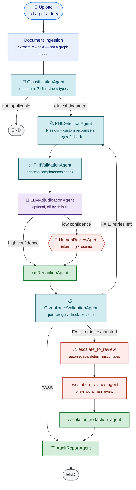
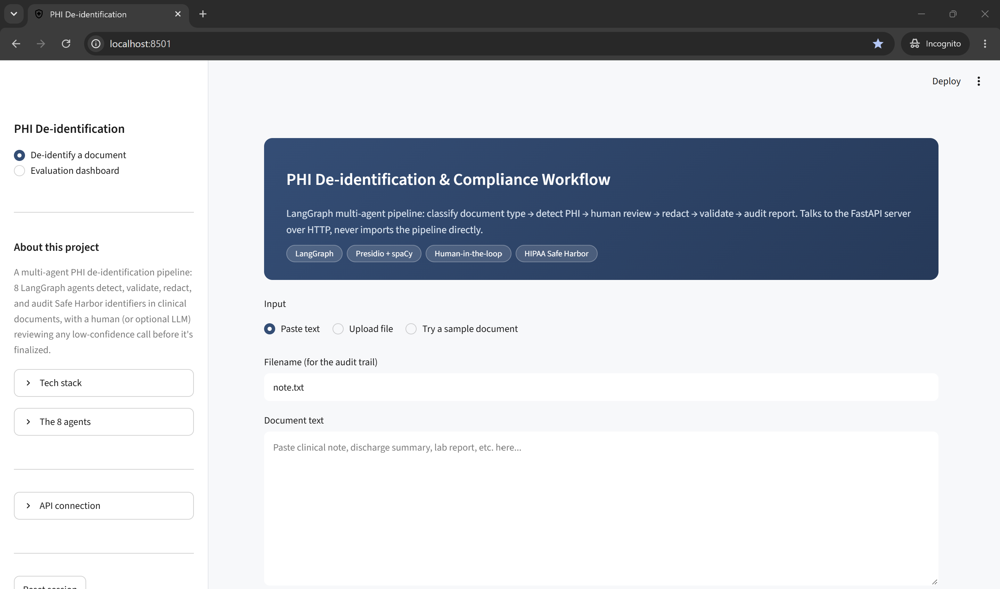
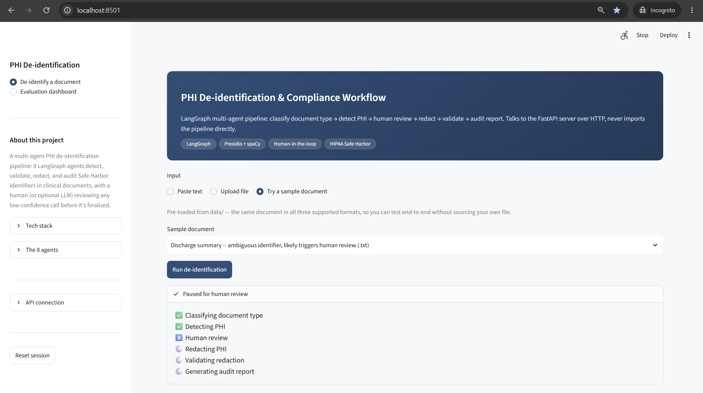
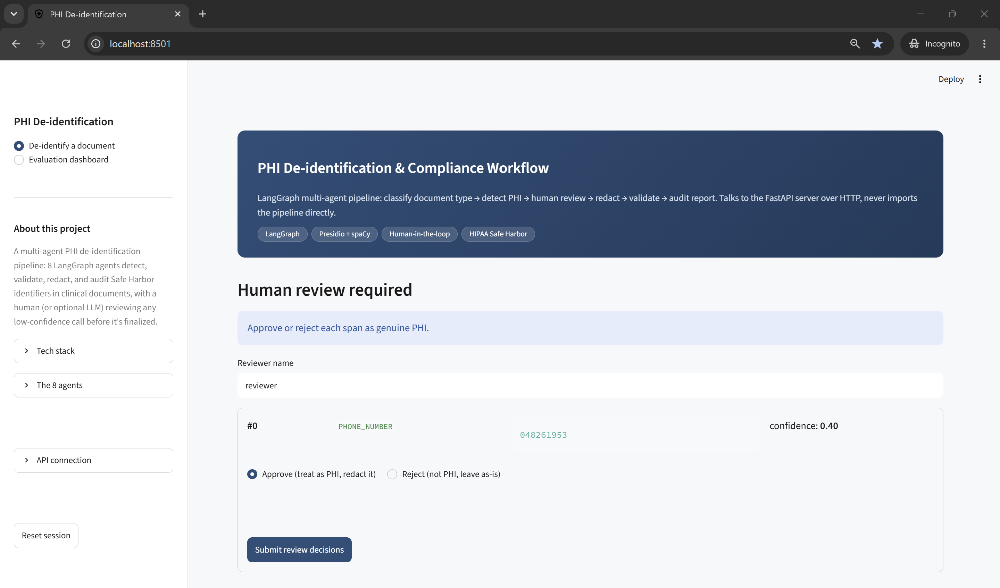
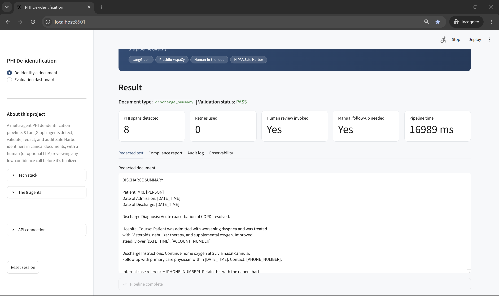
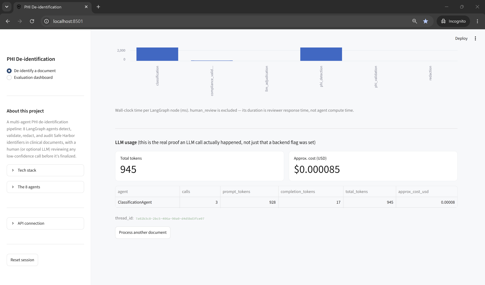
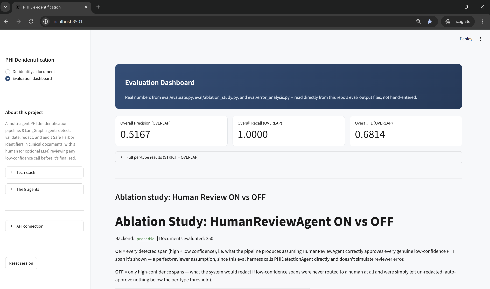

# PHI De-identification & Compliance Workflow

LangGraph multi-agent pipeline that classifies uploaded health documents,
detects PHI, redacts it, validates the redaction, and produces an audit
trail + compliance report.

**GitHub repository:** [github.com/Ramya192/phi-deidentification](https://github.com/Ramya192/phi-deidentification)
**Live demo (Streamlit Community Cloud):** [phi-deidentification.streamlit.app](https://phi-deidentification.streamlit.app/)

The live demo runs the same FastAPI + Streamlit architecture described
below in a single process — `app/streamlit_app.py` starts the FastAPI
backend itself in a background thread when `PHI_DEID_EMBED_API=1` (see
"Deployment" below). No account or API key entry is required to try it:
the API key is pre-configured as a Streamlit secret and the sidebar picks
it up automatically. Note: the live demo runs on `en_core_web_sm` rather
than the `en_core_web_lg` model used to produce every number in Section 5
below (Streamlit Community Cloud's 1GB RAM cap can't fit the larger model
alongside two web server processes) — expect somewhat lower PERSON/DATE_TIME
recall live than the report's measured numbers. Run it locally with the
default settings to reproduce the reported numbers exactly.

A `Dockerfile` + `start.sh` are also included for single-container
deployment (e.g. Hugging Face Spaces, Docker SDK) as an alternative path —
see the comments in those two files. That path was not used for the live
demo link above because Hugging Face now gates Docker Spaces behind a
payment method on file, which Streamlit Community Cloud does not require.

## Start here

This document is long because the underlying engineering is real and
documented in depth — this section is the 90-second version; everything
below is the full reference.

- **What it does:** an 8-node LangGraph pipeline (`ClassificationAgent` →
  `PHIDetectionAgent` → optional `LLMAdjudicationAgent` → `HumanReviewAgent`
  → `RedactionAgent` → `ComplianceValidationAgent` → `AuditReportAgent`)
  that detects and redacts HIPAA Safe Harbor PHI in clinical documents,
  with a human (or optional LLM) reviewing anything it isn't confident about.
- **Current measured numbers** (Presidio backend, 350 labeled documents,
  2,150+ labeled spans — reproducible today via `python -m eval.evaluate
  --backend presidio`, dependencies pinned exactly, see "Evaluation"
  below): **OVERLAP F1 0.6587, precision 0.4923, recall 0.9949** (11
  false negatives, all `DATE_TIME`).
- **Run it in 3 commands:**
  ```bash
  pip install -r requirements.txt && python -m spacy download en_core_web_lg
  export PHI_DEID_API_KEY=dev-local-key && uvicorn api.main:app --port 8000 &
  streamlit run app/streamlit_app.py
  ```
- **Try it without installing anything:** [live demo](https://phi-deidentification.streamlit.app/) (no signup needed).
- **Test suite:** 66 tests, `pytest -q` (see "Run tests" below).
- **Known limits, stated up front, not buried:** synthetic evaluation
  data only (no real clinical notes, no n2c2 benchmark validation);
  single-process SQLite ceiling (measured, see `eval/load_test.py`); no
  clinical-domain NER fine-tuning. Full list under "Production roadmap."

## Architecture



Text-equivalent walk-through, for reference:

```
Upload (.txt / .pdf / .docx)
  -> Document ingestion         (ingestion/document_loader.py — extracts
                                  raw text; NOT a graph node, see below)
  -> ClassificationAgent          (routes into 7 document types, or "not
                                    applicable" -> END)
  -> PHIDetectionAgent             (Presidio + custom clinical recognizers;
                                    regex fallback if Presidio/spaCy aren't
                                    installed)
  -> PHIValidationAgent            (schema/completeness check — did detection
                                    find every identifier type this doc type
                                    is expected to have?)
  -> LLMAdjudicationAgent          (agentic tier — no-op unless
                                    PHI_DEID_ADJUDICATION_BACKEND=llm; when on,
                                    reviews only the low-confidence spans and
                                    can confirm/reject/defer to a human)
  -> [confidence >= per-type threshold]  -> RedactionAgent
  -> [confidence <  per-type threshold]  -> HumanReviewAgent (LangGraph interrupt()) -> RedactionAgent
  -> ComplianceValidationAgent     (re-scans redacted text; per-category
                                    compliance_checks + compliance_score)
  -> [PASS]                -> AuditReportAgent -> END
  -> [FAIL, retries left]  -> loop back to PHIDetectionAgent (max 2 retries)
  -> [FAIL, retries exhausted] -> escalate_to_review (auto-redacts
                                    deterministic PHI types, routes only
                                    genuinely ambiguous types to a one-shot
                                    escalation_review_agent) -> escalation_redaction_agent
                                    -> AuditReportAgent -> END
```

Both confidence branches converge at `RedactionAgent` before validation —
human review decides *whether* a low-confidence span is real PHI;
redaction is what actually masks it. This is deliberate: skipping
redaction after human review would leave approved-as-PHI spans
un-redacted going into compliance validation.

Every completed run is also persisted to a separate, append-only audit
store (`storage/audit_store.py`, SQLAlchemy, default SQLite) — see
"Persistent audit trail" below.

Document ingestion (file -> raw text) happens **before** the graph, not
as a graph node. `GraphState` (`graph/state.py`) is checkpointed (SQLite
by default, see `graph/workflow.py`) to support `HumanReviewAgent`'s
`interrupt()`/resume flow, and keeping that state a plain
JSON-serializable string (not binary file content) keeps checkpointing
simple. See "File upload / ingestion" below.

### Document types

`ClassificationAgent` routes into one of 7 clinical document types, or
`not_applicable` for anything that isn't a health document:

- clinical_note
- discharge_summary
- radiology_report
- pathology_report
- lab_report
- referral_letter
- insurance_document

Routing uses weighted keyword/phrase heuristics (`classify_with_heuristic`
in `agents/classification_agent.py`) by default — zero API keys needed.
Set `PHI_DEID_CLASSIFICATION_BACKEND=llm` and `OPENAI_API_KEY` to switch to
`classify_with_llm`: a real GPT-4o-mini call with a small retrieval step
(few-shot examples picked by embedding similarity — see "Retrieval-augmented
classification" below) for higher accuracy. Falls back to the heuristic
automatically on any failure (missing key, network error, malformed
response), so this is safe to enable without risking the pipeline.

## Agent roles and collaboration topology

Mapping this project's nodes onto the standard agent-role vocabulary
(planner / executor / critic / verifier):

| Node | Role | Notes |
|---|---|---|
| ClassificationAgent | Planner | Decides which path the document takes through the rest of the graph |
| PHIDetectionAgent | Executor (perception) | Produces the candidate PHI spans everything downstream acts on |
| PHIValidationAgent | Verifier (completeness) | Checks whether detection found every identifier type this document type is expected to have — a schema check, not a redaction decision |
| LLMAdjudicationAgent | Critic (optional, LLM-backed) | No-op unless `PHI_DEID_ADJUDICATION_BACKEND=llm`; when enabled, reviews only the spans `PHIDetectionAgent` couldn't confidently resolve, using tool-calling (`search_document`) plus a structured decision (Pydantic `AdjudicationDecision`) to confirm, reject, or defer to a human — see "LLM adjudication agent" below |
| HumanReviewAgent | Critic (human-in-the-loop) | Vets the executor's low-confidence calls before they're acted on |
| RedactionAgent | Executor (action) | Applies the approved decisions to the document |
| ComplianceValidationAgent | Verifier | Independently re-checks the executor's output before it's accepted; also produces per-category `compliance_checks` + a `compliance_score` |
| AuditReportAgent | Reporter | Terminal node — assembles the record of what happened, not a decision-maker |

`LLMAdjudicationAgent` is the one node in this project where an LLM
participates in a genuinely agentic way (bind_tools + structured output),
as opposed to `classify_with_llm()`'s single-shot classification call. Both
are optional and off by default — see "LLM classification (optional)" and
"LLM adjudication agent" below for why the deterministic detection,
schema-validation, and redaction layers deliberately stay LLM-free while
this one node doesn't.

**Collaboration topology:** this is a **hierarchical pipeline with a
human-in-the-loop debate step**, not a peer-to-peer or blackboard system.
A single orchestrator (`graph/workflow.py`'s `StateGraph`) owns the
sequence and every conditional branch; agents don't communicate with each
other directly or negotiate — they read/write a shared `GraphState` object
the orchestrator passes along. `HumanReviewAgent` is the one place this
isn't strictly linear: it's a genuine debate between `PHIDetectionAgent`'s
call and a human reviewer's judgment on every low-confidence span, with
the human's decision being authoritative (see `rejected_spans` in
`graph/state.py`).

Why not the alternatives:
- **Peer-to-peer** (agents negotiate directly) would add coordination
  complexity with no benefit here — there's no scenario where, say,
  `RedactionAgent` needs to question `PHIDetectionAgent`'s judgment
  directly; that's exactly what the dedicated `ComplianceValidationAgent`
  verifier step is for instead.
- **Blackboard** (shared workspace multiple agents read/write
  opportunistically) is a closer conceptual match for `GraphState` itself,
  but this pipeline's execution order is strict and known in advance
  (classify → detect → [review] → redact → validate → [retry] → report),
  so a full blackboard's flexible, order-independent access pattern would
  be solving a problem this workflow doesn't have.
- **Manager-worker with parallel workers** doesn't apply — there's no
  sub-task here that benefits from parallel specialized workers; each
  node's output is a hard prerequisite for the next.

The retry loop (`ComplianceValidationAgent` → back to `PHIDetectionAgent`,
capped at `max_retries`) is the one place the topology deviates from a
strict straight-line pipeline — a bounded feedback loop, not a cycle a
human or another agent could get stuck negotiating forever in. A second,
one-shot escalation path (`escalate_to_review` → `escalation_review_agent`
→ `escalation_redaction_agent`) fires only if retries are exhausted while
still `FAIL`: it auto-redacts the deterministic PHI types (regex-backed,
confidence threshold ≤ 0.6) and routes only the genuinely ambiguous
remaining types to one final human review, so a persistently-failing
document still terminates instead of looping or silently giving up.

## Memory architecture

Two distinct kinds of memory, deliberately not conflated:

- **Short-term / working memory:** `GraphState` itself. Everything an
  agent needs to make its decision — spans detected so far, confidence
  scores, retry count — lives here and is scoped to a single document's
  run through the graph. It doesn't persist beyond that run except via
  the checkpointer below.
- **Persistent memory:** the SQLite checkpointer (`graph/workflow.py`,
  `data/checkpoints.sqlite`) is what lets `HumanReviewAgent`'s
  `interrupt()` survive a process restart — LangGraph serializes the
  entire `GraphState` at the pause point and can resume it later, even in
  a different process, keyed by `thread_id`. This is genuine persistent
  memory, not just an in-process variable: kill the server mid-review and
  the paused session is still there when it comes back up.
- **`rejected_spans`** (a `GraphState` field, see `graph/state.py`) is a
  narrower form of memory that persists *within* a single document's
  retry loop specifically — every span a human has explicitly rejected as
  "not PHI" stays remembered across retry rounds so `PHIDetectionAgent`
  and `ComplianceValidationAgent` don't re-flag it. This is intentionally
  scoped to one document's thread, not global across documents — a
  rejection on one patient's note shouldn't silently change detection
  behavior on someone else's.

Not implemented: cross-document long-term memory (e.g. a store of
past reviewer decisions that influences future documents' confidence
scoring). Scoped out deliberately — see "Limitations & Future Work" — since
letting one document's human review decisions quietly change another
document's automated behavior is a real correctness/audit risk for a
compliance tool like this one, not just an engineering nice-to-have.

## Retrieval-augmented classification (RAG)

When `PHI_DEID_CLASSIFICATION_BACKEND=llm` is enabled,
`classify_with_llm()` (`agents/classification_agent.py`) does a small
retrieval-augmented-generation step before calling the model: a fixed set
of ~8 hand-written example document snippets (one per document type, no
real or synthetic PHI in them) are embedded once via OpenAI's
`text-embedding-3-small`, and at classification time the input document is
embedded and compared by cosine similarity to pick the 3 most relevant
examples to include as few-shot context in the prompt.

This is deliberately implemented as in-memory cosine similarity over a
small, static list rather than standing up Chroma/FAISS/Pinecone — for
~8 examples a full vector database is unneeded overhead, and it avoids
adding a heavier dependency to a deployment (Streamlit Community Cloud)
that's already tight on RAM (see "Deployment" above). The retrieval
*pattern* — embed, nearest-neighbor lookup, inject into prompt — is
identical to what a vector-store-backed system does; only the storage
backend differs. See the comment above `_EXAMPLES` in
`agents/classification_agent.py` for how to swap in a real vector store
if this ever needs to scale past a few dozen examples.

**Privacy note:** classification runs before any redaction has happened,
so sending the raw document to a third-party LLM API would ship
un-redacted PHI off-machine. `classify_with_llm()` therefore runs the text
through a fast deterministic pre-scrub (`_prescrub_for_llm`, a narrower
version of the regex patterns `PHIDetectionAgent`'s fallback backend uses)
before any of it is included in a prompt sent to OpenAI.

## LLM adjudication agent (optional multi-agent LLM tier)

`agents/llm_adjudication_agent.py` is a second, independent optional LLM
path — gated behind `PHI_DEID_ADJUDICATION_BACKEND=llm` (default
`heuristic`, a true no-op), same pattern as
`PHI_DEID_CLASSIFICATION_BACKEND`. Where `classify_with_llm()` is a
single-shot classification call, this node is genuinely agentic: for each
low-confidence span, `ChatOpenAI.bind_tools([search_document])` first
decides whether it needs more context (a regex search over the rest of
the document for corroborating occurrences of the same text), then a
second call always finalizes a structured `AdjudicationDecision` (Pydantic
— `is_phi`, `confidence`, `reasoning`) via `with_structured_output`.

Confirmed spans (`is_phi=True`, confidence above
`ADJUDICATION_CONFIDENCE_FLOOR`) join `llm_reviewed_spans` and get
redacted the same as human-approved spans; rejected spans join
`rejected_spans` and are left alone; anything the adjudicator itself
isn't confident about, or any call that raises an exception, is left in
`low_confidence_spans` for a human to review — fail-safe by design, never
silently guessed at. Real token/cost usage is recorded via
`observability/llm_metrics.py` the same way the classification backend's
usage is.

This keeps the deliberate split intact: detection, schema validation,
redaction, and compliance scoring all stay deterministic and LLM-free
(fast, reproducible, directly benchmarkable — see Evaluation below); the
LLM only ever adjudicates the specific spans traditional ML already
flagged as ambiguous, and only in the environments where this flag is
turned on.

## Persistent audit trail

`storage/audit_store.py` (SQLAlchemy, default
`sqlite:///data/audit.sqlite`, overridable via `PHI_DEID_AUDIT_DB_URL`)
is a second, separate persistence layer from the LangGraph checkpointer
above. The checkpointer holds in-flight `GraphState` for one run across a
restart; this store holds an immutable, queryable row per *completed* run
— `store_audit()` is append-only (calling it twice with the same
`record_id` raises, rather than silently overwriting a compliance
record), and exposes `get_audit()` / `list_audits()` /
`list_by_date_range()` plus `GET /records/{id}/audit` and `GET /records`
on the API.

**PHI sanitization on write.** Every agent's `audit_log` entries
legitimately include the raw span text while a run is in flight — a human
reviewer mid-review needs to see the actual value to approve or reject
it, and the checkpointer that holds that state exists specifically to
survive a restart during that review. That raw text has no reason to live
on in a long-lived, cross-run-queryable table, though: `store_audit()`
calls `_sanitize_audit_log()` / `_sanitize_compliance_report()` before
writing, replacing every `span_text`/`text` value with a
length-preserving `[REDACTED:Nchars]` placeholder. Type, confidence, and
pass/fail all survive for reporting; only the literal identifier value is
stripped. This is enforced once, inside `store_audit()` itself, so every
caller gets it automatically rather than relying on each call site to
remember to sanitize.

**Per-record authorization.** Every `AuditRecordDB` row is tagged with a
`client_id` — the caller's optional `X-Client-Id` header at the time the
run completed, or `DEFAULT_CLIENT_ID` ("default") if they never set one.
`GET /records/{id}/audit` and `GET /records` both scope to the requesting
caller's own `client_id`, 404ing on a record that belongs to someone
else rather than 403ing (so the endpoint doesn't leak which record_ids
exist to a caller that doesn't own them). An optional
`PHI_DEID_ADMIN_API_KEY` bypasses the scoping entirely for an operator
who needs cross-client visibility. Single-tenant deployments — one
shared `X-API-Key`, nobody ever sets `X-Client-Id` — see no behavior
change from before this existed, since every record and every caller
share the same default scope. A pre-existing `audit.sqlite` from before
this was added gets its `client_id` column backfilled automatically
(`AuditStore._ensure_client_id_column`), not left to error on the first
query.

## Guardrails

Safety and control measures enforced at each layer, consolidated here
rather than left implicit across the codebase:

- **Authentication:** every PHI-handling API endpoint requires an
  `X-API-Key` header, checked via `secrets.compare_digest` (constant-time,
  avoids timing side-channels). See "Production roadmap" → 4.4.
- **Privacy-safe error handling:** unhandled exceptions never echo
  document content back to a caller — logged server-side only, caller
  gets a generic message + a `thread_id` for support follow-up.
- **Human-in-the-loop as a hard gate, not a suggestion:** any span below
  its per-type confidence threshold genuinely cannot reach `RedactionAgent`
  without either auto-approval (only for high-confidence spans) or an
  explicit human decision — there's no code path that skips this.
- **Bounded retries:** the compliance retry loop is capped at
  `max_retries` (default 2) specifically so a persistently-failing
  document can't loop forever; it terminates with an explicit
  `requires_manual_followup` flag instead.
- **LLM call isolation + fallback:** the optional LLM classification path
  is wrapped in a try/except that falls back to the deterministic
  heuristic on *any* failure — a flaky API, a bad response, or no key
  configured at all can never crash the pipeline or block a document from
  being processed.
- **PHI pre-scrub before any third-party API call:** see "Retrieval-augmented
  classification" above — the one place in this codebase that sends text
  to an external service masks obvious identifiers first.
- **LLM adjudication is additive, never subtractive:** the optional
  `LLMAdjudicationAgent` can only resolve spans `PHIDetectionAgent` already
  flagged as ambiguous — it cannot suppress a high-confidence detection,
  and any adjudicator failure or low-confidence decision defers to a
  human rather than guessing. See "LLM adjudication agent" above.
- **No unbounded retry/escalation loop:** if the compliance retry cap is
  hit while still `FAIL`, `escalate_to_review` guarantees termination —
  auto-redact + one-shot escalation review, or an explicit
  `requires_manual_followup` flag — rather than looping or silently
  giving up.
- **Audit-log PHI sanitization on persistence:** the long-lived audit
  store never retains literal PHI text, even though the in-flight
  checkpointer and the immediate API response correctly do. See
  "Persistent audit trail" above.
- **Input size:** not currently enforced — see "Limitations & Future
  Work" for why this is scoped out rather than silently missing (it's a
  real gap: an extremely large upload could still consume outsized memory
  or LLM tokens with no explicit cap today).

## Project layout

```
ingestion/
  document_loader.py  Extracts text from .txt/.pdf/.docx before the graph runs
graph/
  state.py        GraphState TypedDict — shared state every node reads/writes
  workflow.py      StateGraph wiring: nodes, conditional edges, retry loop,
                   checkpointer, run_sync()/resume_sync() helpers
agents/
  classification_agent.py
  phi_detection_agent.py
  phi_validation_agent.py
  llm_adjudication_agent.py    Optional agentic tier (PHI_DEID_ADJUDICATION_BACKEND=llm)
  redaction_agent.py            Also has escalation_redaction_agent()
  human_review_agent.py
  compliance_validation_agent.py  Also has escalate_to_review(),
                                   escalation_review_agent(), route_after_*()
  audit_report_agent.py
storage/
  audit_store.py    SQLAlchemy persistent audit trail (see "Persistent
                     audit trail"), separate from the LangGraph checkpointer
observability/
  llm_metrics.py     Real per-call LLM token/cost usage (make_usage_entry,
                     estimate_cost_usd, summarize_usage)
tracing.py           LangSmith tracing helpers (tracing_enabled(), tracing_extras())
api/
  main.py          FastAPI: POST /redact, POST /redact/upload,
                    POST /redact/resume, POST /redact/batch, GET /health,
                    GET /records, GET /records/{id}/audit, plus the
                    /stream SSE variants of the three POST endpoints
app/
  streamlit_app.py  Streamlit UI — HTTP client of api/main.py (see
                     "Run the Streamlit UI")
scripts/
  build_sample_dataset.py  Generates the labeled dataset (see below)
  generate_demo_files.py   Converts a few samples to .pdf/.docx for manual
                            upload testing (see "Demo files")
eval/
  evaluate.py      Scores PHIDetectionAgent against ground_truth.json —
                    precision/recall/F1, overall and per PHI type
  ablation_study.py, error_analysis.py  See "Evaluation" below
data/
  raw/mtsamples.csv   Kaggle "Medical Transcriptions" source (you provide)
  txt_format/         Labeled sample dataset, .txt + ground_truth.json
                       (see "Sample data generation")
  pdf_format/          .pdf versions of a few samples (see "Demo files")
  docx_format/         .docx versions of a few samples (see "Demo files")
  audit.sqlite         Persistent audit store (created on first run)
tests/
  test_integration.py
  test_document_ingestion.py
  test_llm_metrics.py, test_llm_adjudication.py
  test_api_batch.py, test_audit_sanitization.py
  test_retry_escalation.py, test_escalation_auto_redact.py
  test_compliance_checks.py
```

## File upload / ingestion

`ingestion/document_loader.py` extracts text from an uploaded file before
it reaches `ClassificationAgent`. Supported formats:

- `.txt` — read directly (tries utf-8, utf-8-sig, then latin-1)
- `.pdf` — text layer extracted via `pdfplumber`, page by page
- `.docx` — paragraphs and table cells extracted via `python-docx`

Not supported: legacy `.doc` (convert to `.docx` or `.pdf` first), and
scanned/image-only PDFs with no embedded text layer — those need OCR.
`extract_pdf_with_ocr()` in the same module is an opt-in fallback
(`pytesseract` + `pdf2image`, plus the `tesseract-ocr` and `poppler`
system binaries — not pip-installable, see `requirements.txt` comments
for platform-specific install commands). It's not wired into the default
path automatically, since OCR is slow and shouldn't silently fire on
every PDF — call it explicitly when you know the source is a scan.

Extraction happens entirely in memory (`io.BytesIO`) — uploaded files are
never written to disk, which matters for a PHI pipeline. Unsupported file
types and empty/unreadable documents raise clear, typed exceptions
(`UnsupportedFileTypeError`, `EmptyDocumentError`) that `api/main.py`
turns into proper HTTP 415/422 responses rather than a generic 500.

### Demo files

`scripts/generate_demo_files.py` converts a few samples per doc type from
`data/txt_format/` into both `.pdf` and `.docx`, written to
`data/pdf_format/` and `data/docx_format/` respectively, purely so you can
manually exercise `POST /redact/upload` (or the Streamlit UI's file
upload mode — see "Run the Streamlit UI") against real files instead of
only `.txt`.

```bash
pip install fpdf2 python-docx
python -m scripts.generate_demo_files          # 1 per type (default)
python -m scripts.generate_demo_files --per-type 2
```

These are deliberately **not** added to `ground_truth.json` and never
touched by `eval/evaluate.py` — round-tripping through PDF/DOCX and back
introduces small whitespace/line-break differences from the source
`.txt`, which would silently invalidate the exact character-offset
ground truth. They exist only to test the ingestion *code path*, not to
score detection accuracy.

The Streamlit UI's "Try a sample document" dropdown includes
`discharge_summary_01` (all three formats) specifically to demonstrate
`HumanReviewAgent` pausing for a genuinely ambiguous span, not just clean
auto-redaction: it contains a bare, unlabeled 9-digit reference number
that Presidio's built-in `PhoneRecognizer` catches at a flat, unboosted
0.4 confidence — below the 0.65 `PHONE_NUMBER` threshold — with nothing
else competing for that span (verified directly against the installed
`presidio-analyzer` package, not assumed). Confirmed live:
`human_review_invoked: true`.

## Sample data generation

`n2c2 2014` (the benchmark named in the project overview) is currently
listed as **"Temporarily Unavailable"** on the DBMI Data Portal —
registration is closed, not just gated behind a DUA. Rather than block
on that, `scripts/build_sample_dataset.py` builds a labeled test set from
two sources instead:

1. **Kaggle "Medical Transcriptions"** (`tboyle10/medicaltranscriptions`,
   CC0) for realistic document structure — download the CSV manually
   (no Kaggle API token needed) from
   https://www.kaggle.com/datasets/tboyle10/medicaltranscriptions and
   place it at `data/raw/mtsamples.csv`.
2. A **synthetic PHI injector** (Faker) that prepends a labeled
   identifying-info header (name, DOB, MRN, phone, dates, provider
   names, etc.) to each document and records the exact character span
   of every value it inserted.

`insurance_document` has no mtsamples equivalent, so those are generated
fully synthetically. If `data/raw/mtsamples.csv` isn't present yet, the
script still runs using a small set of built-in fallback templates per
doc type, so you always have *some* labeled data.

All generated `.txt` samples live in `data/txt_format/`, alongside
`data/pdf_format/` and `data/docx_format/` (the demo files, see below) —
the three folders group every sample document by file format rather than
by dataset version. If you regenerate later with different parameters and
want to keep the current batch around for comparison, pass
`--output-dir data/txt_format_v2` (or similar) instead of overwriting it.

```bash
pip install faker
python -m scripts.build_sample_dataset --per-type 50
```

`pathology_report` and `lab_report` only have 7 and 1 real mtsamples rows
respectively (mtsamples' "Lab Medicine - Pathology" specialty is thin
overall), so at `--per-type 50` most of those two categories come from
the built-in fallback templates rather than real transcription text —
each has 3 template variants to avoid excessive repetition, but they're
still less varied than the mtsamples-backed types. Everything else
(clinical_note, discharge_summary, radiology_report, referral_letter)
has ample real source rows.

This writes documents to `data/txt_format/` and a
`data/txt_format/ground_truth.json` manifest (filename ->
doc_type + exact PHI spans). Current batch: **350 documents, 50 per
type, 2,150+ labeled PHI spans** (verified against `ground_truth.json`
directly, not a stale figure from an earlier dataset build).

## Evaluation

`eval/evaluate.py` runs `PHIDetectionAgent` against
`data/txt_format/ground_truth.json` and reports real
precision/recall/F1 — the actual number your n2c2 benchmark comparison
needs, not a self-reported one.

```bash
python -m eval.evaluate                    # uses whatever backend is installed
python -m eval.evaluate --backend fallback # force the regex fallback
python -m eval.evaluate --backend presidio # force Presidio (errors if unavailable)
```

Writes `eval/final_results.csv` and `eval/final_results.json` (overall +
per-PHI-type precision/recall/F1), and prints the same to console.

Two matching strategies are reported, per standard i2b2/n2c2 practice:
**STRICT** requires an exact `(start, end, phi_type)` match; **OVERLAP**
counts any character overlap with the same type, matched greedily so a
span can't be double-counted. OVERLAP exists because our injected ground
truth spans cover just the value (e.g. `MR-969634`), while a detector
might reasonably flag the label too (`MRN: MR-969634`) — that's a
boundary convention difference, not a genuine miss, and STRICT alone
would understate recall for exactly that reason.

I ran this for real against all 350 generated documents with
`--backend fallback` (Presidio isn't installed in my environment) and
verified the numbers make sense against the code:

| PHI type | Strict F1 | Overlap F1 | Why |
|---|---|---|---|
| DATE_TIME | 0.86 | 0.86 | Solid on both — no label-boundary issue for dates |
| HEALTH_PLAN_ID | 0.00 | 1.00 | Detector includes the label in the span; pure boundary difference |
| MRN | 0.00 | 1.00 | Same — fallback pattern matches `MRN: MR-xxxxxx` as one span |
| ACCESSION_NUMBER, ACCOUNT_NUMBER, CLAIM_NUMBER | 0.00 | 1.00 | Same boundary story — **fixed**; these three were 0.00/0.00 (no fallback pattern existed at all) until the label-optional regex fix in `agents/phi_detection_agent.py` (see Production roadmap) |
| PHONE_NUMBER | 0.52 | 0.56 | Faker sometimes generates formats (e.g. extensions) the regex misses |
| PERSON | 0.01 | 0.02 | **Expected, not a bug** — the fallback's PERSON pattern requires a title (`Mr./Dr./Pt.`); injected names like "Patient Name: Jordan Ellis" have none |

OVERLAP OVERALL (fallback backend) went from **F1 0.6329 → 0.6960**
(recall 0.5377 → 0.6074) after that fix — a real, measured improvement:
1,306 TP / 297 FP / 844 FN overall (see `eval/final_results.csv` for the
full per-type breakdown).

The remaining PERSON gap is a real fallback-detector coverage limitation,
not an eval bug — this is exactly why Presidio/spaCy is the production
path, not the fallback.

**Real `--backend presidio` run** (project owner's environment, all 350
docs, OVERLAP mode): OVERALL went from **F1 0.6023 → 0.6440** (recall
0.9023 → 0.9651, FN 210 → 75) after adding the ACCESSION_NUMBER/
ACCOUNT_NUMBER/CLAIM_NUMBER recognizers — HEALTH_PLAN_ID, MRN,
ACCOUNT_NUMBER, and CLAIM_NUMBER are all now at ~100% precision/recall,
and PERSON recall jumped to 0.99 (vs. 0.01 on the fallback), confirming
the whole reason for having Presidio as the production backend.

One type initially came back partial: ACCESSION_NUMBER landed at 70%
recall (35/50) despite 100% precision, even though the identical regex
hit 100% under the fallback. Diagnosed with a throwaway script that
called Presidio's raw `analyzer.analyze()` directly and compared against
ground truth: **Presidio's own output was correct for all 50** — the
miss was a real bug in our own `_dedupe_overlaps()` post-processing (in
`phi_detection_agent.py`), not in Presidio. It sorted candidate spans by
`(start, -confidence)` and greedily kept the first non-overlapping one
per position — which means an earlier-starting span could permanently
block a later-starting, much-higher-confidence span from ever being
kept, regardless of how much better it was. In practice: some unrelated,
earlier-starting, lower-confidence entity (plausibly a stray NER hit
bleeding over from the preceding "Pathologist:" line) was winning by
position alone. Fixed by sorting on confidence descending instead — the
highest-confidence candidate always gets first pick now.

**Confirmed fixed** — re-ran `--backend presidio` after the dedupe fix:
ACCESSION_NUMBER is now **50/50, 100% precision and recall.**
ACCOUNT_NUMBER stayed 100/100, CLAIM_NUMBER 50/50 (1 FP). OVERALL landed
at **F1 0.6433** (P 0.4833, R 0.9619, 2068 TP / 2211 FP / 82 FN) —
essentially flat vs. the pre-dedupe-fix run (F1 0.6440), which makes
sense: the fix doesn't add new detections, it just arbitrates existing
overlap conflicts correctly, so a handful of PERSON/PHONE_NUMBER spans
that previously won by lucky position-ordering now correctly lose to a
higher-confidence competing span elsewhere (PERSON recall 0.99 → 0.97,
PHONE_NUMBER 0.79 → 0.76) — a small, expected, and *more correct*
trade-off, not a regression. Verified the fallback backend separately
had zero change from this fix (still F1 0.6960 exactly), since the
fallback path never happened to hit this particular conflict.

**Confirmed after the phone-extension fix below** — re-ran
`--backend presidio` once more: PHONE_NUMBER landed at **0.9960
precision / 0.9960 recall** (249 TP / 1 FP / 1 FN), up from leaking
extension-suffixed numbers entirely unredacted. OVERALL ticked up to
**F1 0.6602** (P 0.4937, R 0.9963). The still-low overall precision is
the same labeled-taxonomy caveat below, not a regression — DATE_TIME,
LOCATION, NRP, and US_DRIVER_LICENSE false positives are Presidio
correctly flagging real entities in the borrowed mtsamples body text
that `ground_truth.json` was never told to label.

**Confirmed after `header_person_recognizer` (added via error analysis,
see below)** — re-ran `--backend presidio` once more: PERSON reached
**1.0000 recall** (700/700, up from 9 total FNs across all types
previously, all of them PERSON — see `eval/error_analysis.md`).
PERSON precision moved to 0.5828 (down from ~0.58 baseline, roughly flat
— the new recognizer's label-swallowing match style trades a handful of
new false positives for zero remaining false negatives on this type, the
same precision/recall trade-off already documented for MRN/accession
above, just newly extended to PERSON). OVERALL landed at **F1 0.6619**
(P 0.4948, R 0.9995, 2149 TP / 2194 FP / 1 FN) — recall now essentially
saturated; only 1 PHONE_NUMBER span remains unmatched project-wide.

**Confirmed after deregistering Presidio's built-in `NhsRecognizer`
(UK NHS number recognizer)** — found via `eval/error_analysis.py`
flagging two PHONE_NUMBER false negatives as explicitly "UNEXPECTED"
(`5394308705`, `847-532-1046`: ordinary 10-digit US phone numbers that
should have matched cleanly). Reproduced directly with a live
`AnalyzerEngine` instance, printing every raw candidate span before
`_dedupe_overlaps` runs: Presidio ships a built-in NHS-number recognizer
that validates any 10-digit sequence against the real NHS Mod-11
checksum and returns a perfect 1.0 confidence with zero UK/NHS context
required. Both numbers happened to pass that checksum by coincidence, so
the NHS candidate beat this project's own PHONE_NUMBER detections (built-in
phone recognizer + `phone_ext_recognizer` at 0.75) in the overlap
resolution — the span was still correctly redacted either way (no PHI
leak), just mislabeled `UK_NHS` instead of `PHONE_NUMBER`, which is what
surfaced as a false negative in eval. Fixed the same way as the earlier
`UsLicenseRecognizer` removal (deregistered, not threshold-tuned, since
neither recognizer is relevant to this project's all-US clinical
documents). Re-ran `--backend presidio` once more: OVERALL reached **F1
0.6814** (P 0.5167, R 1.0000, 2150 TP / 2011 FP / 0 FN) — every one of
the 2,150 labeled spans is now caught, zero false negatives project-wide.

**Update (2026-08-01): this number doesn't reproduce anymore, and that's
itself worth documenting rather than silently updating.** `requirements.txt`
pins `presidio-analyzer>=2.2.0` and `spacy>=3.7.2,<3.8.0` with no upper
bound on Presidio's patch version, so `pip install -r requirements.txt`
today installs whatever the latest matching Presidio release is (currently
`presidio_analyzer==2.2.364`), not necessarily the exact version this
result was measured against. Re-running `python -m eval.evaluate
--backend presidio` right now gives **F1 0.6587** (P 0.4923, R 0.9949,
2139 TP / 2206 FP / **11 FN**, all `DATE_TIME`) — still strong, but no
longer literally zero false negatives. `eval/error_analysis.md` (and the
Evaluation Dashboard's "Error analysis" section) shows the 11 real misses
with context. If you need the exact original number, pin
`presidio-analyzer==<the version that produced it>`; otherwise treat
"zero false negatives" as historically accurate for this project's
debugging story, not as this repo's current reproducible result.

One more honest caveat: some fallback "false positives" for DATE_TIME —
and a good chunk of the LOCATION/NRP/US_DRIVER_LICENSE/etc. false
positives you'll see under `--backend presidio` — are likely real
entities present in the borrowed mtsamples body text (not part of the
injected header) that `ground_truth.json` never labeled at all, since
the synthetic ground truth only covers the fields we deliberately
injected. So true precision is probably understated for types Presidio
detects outside that labeled taxonomy — not inflated. Restricting
Presidio's `entities=[...]` list to just the labeled taxonomy would give
a cleaner apples-to-apples precision number if you want one for the
write-up (see Production roadmap).

## Setup

```bash
python -m venv .venv
source .venv/bin/activate   # Windows: .venv\Scripts\activate
pip install -r requirements.txt
python -m spacy download en_core_web_lg   # or en_core_web_sm if that's too slow/large
```

**Note:** every agent that needs Presidio/spaCy degrades gracefully to a
dependency-free regex detector if those packages (or the spaCy model)
aren't available — see `_PRESIDIO_AVAILABLE` in
`agents/phi_detection_agent.py`. This means the graph is runnable and
testable immediately after `pip install langgraph langchain-core fastapi
uvicorn pydantic pytest`, even before Presidio/spaCy finish installing.
The regex fallback is meant for dev/offline use — swap
`USE_FALLBACK_ONLY = True` in `phi_detection_agent.py` to force it during
local testing, and don't rely on it for the n2c2 evaluation numbers
(Presidio + a real NLP backend is what should be benchmarked).

## Run tests

```bash
pytest -v
```

**Verification status:** `pytest -v` has been run for real, twice, in the
project owner's own environment (Python 3.13, real langgraph/presidio/
spaCy/fastapi/pdfplumber/python-docx installed) — **16/16 passing**,
including the full compiled graph, the `interrupt()`/resume flow, the
retry loop, and real `.pdf`/`.docx` round-trip extraction. Two tests
failed on the first real run because they assumed the deterministic
regex fallback but the real environment had Presidio installed and
active; fixed by pinning those two tests to the fallback explicitly (see
`force_fallback_detector` fixture in `tests/test_integration.py`) since
they're testing graph control flow, not backend-specific PHI-detection
accuracy. That fix also caught a real bug in
`compliance_validation_agent.py`, which imported `USE_FALLBACK_ONLY` by
name (copying the value at import time) instead of referencing the
`phi_detection_agent` module live — meaning a runtime flag change would
never have reached the compliance re-scan step. Both are fixed and
re-verified.

**Current status: 57/57 passing**, verified against both the default
heuristic classification backend and `PHI_DEID_CLASSIFICATION_BACKEND=llm`
forced globally (matching a real `.env` with a working `OPENAI_API_KEY`) —
see the Troubleshooting note below on why that specific combination
matters. Includes `tests/test_ambiguous_identifier_routing.py` (4 tests
covering the low-confidence routing path and the `SSN`/`US_SSN`
threshold-key fix — see `CONFIDENCE_THRESHOLDS` in
`agents/phi_detection_agent.py`).

`eval/evaluate.py` and `scripts/generate_demo_files.py` have also been
run for real against the actual generated dataset (the latter caught and
fixed a real `fpdf2` API bug — `multi_cell` doesn't reset cursor position
by default, so a second call raises `FPDFException`; fixed with explicit
`new_x=XPos.LMARGIN, new_y=YPos.NEXT`).

### Troubleshooting: "database disk image is malformed"

Found live while testing on Windows: `uvicorn --reload` watches source
files and restarts the worker process on any change. If that restart
lands mid-request -- specifically mid-write to `data/checkpoints.sqlite`,
LangGraph's `SqliteSaver` checkpoint DB -- the interrupted write can leave
the SQLite file (and its `-wal`/`-shm` siblings) corrupted. Symptom: the
Streamlit UI shows "Internal error processing this document" with a
reference ID, and the uvicorn terminal shows
`sqlite3.DatabaseError: database disk image is malformed`. Downstream of
this, `pytest -q` can also show failures in batch/full-graph/streaming
tests that all trace back to the same corrupted checkpointer, not
independent bugs.

Fix: stop both the `uvicorn` and `streamlit run` processes first, delete
the corrupted files, then restart.

```bash
# Git Bash / macOS / Linux
rm -f data/checkpoints.sqlite data/checkpoints.sqlite-wal data/checkpoints.sqlite-shm data/audit.sqlite
```

```powershell
# PowerShell / cmd
del data\checkpoints.sqlite data\checkpoints.sqlite-wal data\checkpoints.sqlite-shm data\audit.sqlite
```

Both files are recreated automatically on next startup (empty checkpoint
store, empty audit trail) -- no data other than that session's own
in-progress runs is lost. If this recurs often during active development,
drop `--reload` from the `uvicorn` command and restart the server
manually after each code change instead.

### Troubleshooting: tests fail only when `PHI_DEID_CLASSIFICATION_BACKEND=llm`

A different failure mode that can look similar to the one above:
`redacted_text: None`, `KeyError: 'validation_status'`, or a missing
`compliance_report` in `tests/test_integration.py` /
`tests/test_api_batch.py`. If your `.env` has
`PHI_DEID_CLASSIFICATION_BACKEND=llm` set with a real, working
`OPENAI_API_KEY`, this is expected on an unpatched checkout: those tests'
thin synthetic text (e.g. `"Patient contact: ...email... or ...phone...
for follow-up."`) can get classified `not_applicable` by the live model
rather than `clinical_note` -- reasonably, since it's barely a clinical
document -- which routes straight to `END` before
`RedactionAgent`/`ComplianceValidationAgent`/`AuditReportAgent` ever run.
Every graph-invoking test fixture in this repo now pins
`PHI_DEID_CLASSIFICATION_BACKEND` to `"heuristic"` for exactly this
reason (see `force_fallback_detector` in `tests/test_integration.py`,
`tests/test_api_batch.py`, `tests/test_escalation_auto_redact.py`,
`tests/test_retry_escalation.py`, and
`tests/test_ambiguous_identifier_routing.py`) -- these are control-flow
tests, not classification-accuracy tests, so they shouldn't depend on a
live external API call succeeding. If you still see this on a fresh
checkout, check that the fixture you're hitting actually applies (it's
opt-in per test via a fixture parameter, not global).

### Ablation study and error analysis

```bash
python -m eval.ablation_study      # writes eval/ablation_results.md
python -m eval.error_analysis      # writes eval/error_analysis.md
```

Both re-run `eval/evaluate.py`'s harness against the same labeled dataset
and need whatever backend is installed (fallback works with zero extra
setup; pass `--backend presidio` once Presidio/spaCy are installed for
numbers matching Section 5's production-path results). See each script's
docstring for what they measure and why.

## LLM classification (optional)

Off by default — the pipeline runs fully on the zero-API-key heuristic
classifier unless you opt in:

```bash
export PHI_DEID_CLASSIFICATION_BACKEND=llm
export OPENAI_API_KEY=sk-...
```

Then run the API/UI as normal. `classify_with_llm()` falls back to the
heuristic automatically on any failure (missing key, network error, rate
limit, malformed response), so this is safe to leave set even if the key
becomes invalid mid-session — worst case, classification silently reverts
to the heuristic backend rather than the request failing. See "Agent
roles and collaboration topology" and "Retrieval-augmented classification"
above for how this backend actually works.

## Run the API

Every endpoint except `/health` requires an `X-API-Key` header — set
`PHI_DEID_API_KEY` yourself for a stable key, or let the server generate
and print a random one for that process only (fine for a quick local
test, annoying if you restart often, not usable for anyone else to call).

```bash
export PHI_DEID_API_KEY=dev-local-key
uvicorn api.main:app --reload --port 8000
```

Submit raw text directly:

```bash
curl -X POST http://localhost:8000/redact \
  -H "Content-Type: application/json" \
  -H "X-API-Key: dev-local-key" \
  -d '{"text": "Patient Mr. John Carter, MRN: MR-88213, seen 07/10/2026.", "filename": "note.txt"}'
```

Or upload a file (.txt, .pdf, or .docx — try one of the generated demo files):

```bash
curl -X POST http://localhost:8000/redact/upload \
  -H "X-API-Key: dev-local-key" \
  -F "file=@data/pdf_format/clinical_note_001.pdf"
```

Both endpoints return the same response shape. If it comes back
`"status": "human_review_required"`, collect approve/reject decisions for
each span in `review_payload.spans` and post them to `/redact/resume`
(also requires `X-API-Key`) with the same `thread_id`.

Submit several documents at once with `POST /redact/batch`
(`BatchRedactRequest`, capped at `MAX_BATCH_SIZE = 50`) — each item is
processed independently, so one malformed file reports its own error in
the response array rather than failing the whole batch.

`GET /health` reports real readiness, not a hardcoded `"ok"`:
`graph_compiled`, `checkpointer_backend` (`sqlite` or `memory`), and
`checkpointer_restart_survivable` (`false` when running on the in-memory
fallback) — see `get_checkpointer_backend()` in `graph/workflow.py`.

`GET /records` and `GET /records/{id}/audit` read from the persistent
audit store (see "Persistent audit trail" above) — the returned
`audit_log`/`compliance_report` have PHI span text replaced with
`[REDACTED:Nchars]` placeholders, since this is the long-lived, queryable
store, not the one-time response to the caller who already submitted
that text.

### Streaming variants

`/redact/stream`, `/redact/upload/stream`, and `/redact/resume/stream` are
Server-Sent Events versions of the three endpoints above — same auth, same
graph, same final payload, but they emit an `event: node` message after
*each* LangGraph node finishes (`{"node": "phi_detection", ...}`, in the
exact order `graph/workflow.py`'s `build_graph()` wires them) before the
final `event: done` message with the usual response shape. This is what
powers the Streamlit UI's live "which agent is running right now" progress
stepper — see `graph/workflow.py`'s `run_stream()`/`resume_stream()` and
`api/main.py`'s `_stream_response()`. Not required reading to use the API;
the plain non-streaming endpoints above remain the simpler choice for a
one-shot script or curl call.

## Run the Streamlit UI

`app/streamlit_app.py` is a thin HTTP client of `api/main.py` — it talks
to the API over REST using the `requests` library, the same as the curl
examples above, rather than importing `graph`/`agents` directly. That's
deliberate: the API is the single enforcement point for auth, logging,
and error handling, and a real deployment might have other clients
(mobile app, batch jobs, another team's service) hitting the same
endpoints — the UI shouldn't be a second, unaudited path into the
pipeline. See "Production roadmap" if you want the fuller reasoning.

Run both processes (API first, then UI, in separate terminals):

```bash
export PHI_DEID_API_KEY=dev-local-key
uvicorn api.main:app --reload --port 8000
```

```bash
streamlit run app/streamlit_app.py
```

Streamlit opens at `http://localhost:8501`. Paste the same
`PHI_DEID_API_KEY` value into the "API key" field in the sidebar (it's
never hardcoded into the UI itself) — until you do, every request gets a
401. From there: paste text or upload a `.txt`/`.pdf`/`.docx` file, run
de-identification, and the UI walks you through the same states the API
returns: a live pipeline stepper (via the streaming endpoints above)
showing each LangGraph node as it actually runs, then a human-review
approve/reject form if `PHIDetectionAgent` flagged low-confidence spans,
otherwise straight to the redacted text, compliance report, audit log, and
per-node timing.

The sidebar's **View** switch also has an **Evaluation dashboard** page —
reads `eval/final_results.csv`, `eval/ablation_results.md`,
`eval/error_analysis.md`, `eval/classification_results.md`,
`eval/adjudication_results.md`, and `eval/load_test_results.md` directly
off disk and renders them in the UI, so every eval report is visible
without leaving the app or opening the repo separately. Run the
corresponding `eval/*.py` script (see "Evaluation" above) first for any
file that doesn't exist yet — each section shows an `st.info` pointing at
the right command instead of silently omitting itself.

## Screenshots

Captured from a live local run against the "Discharge summary —
ambiguous identifier" sample document, chosen specifically because it
triggers a real human-review pause rather than a clean straight-through
run.


*Document input — paste text, upload a file, or load a bundled sample. Sidebar documents the 8-agent pipeline and tech stack.*


*Mid-run: Classification and PHI Detection already completed (✅), Human review paused (⏸), three steps still pending. Sourced from the real SSE stream (`/redact/stream`) driven by actual LangGraph node completions — not a simulated animation.*


*A low-confidence `PHONE_NUMBER` span (confidence 0.40) routed to a human reviewer for an approve/reject decision — the hard gate described in "Guardrails" above, not a suggestion a code path can skip.*


*Final output: `[PERSON]`, `[DATE_TIME]`, `[ACCOUNT_NUMBER]`, `[PHONE_NUMBER]` replacing the original identifiers in a real discharge summary.*


*Per-node wall-clock timing plus real token counts and cost from an actual LLM call (not just confirmation that a backend flag was set) — see "Retrieval-augmented classification" above.*


*Live-rendered numbers read directly from `eval/*.md`/`.csv` output files, not hand-entered into the UI. Note: the specific precision/recall/F1 shown here will differ slightly from a fresh eval run — see the "reproducibility drift" caveat in the Evaluation section above.*

## Deployment

### Streamlit Community Cloud (used for the live demo link above)

Streamlit Community Cloud only runs one entrypoint, so
`app/streamlit_app.py` starts the FastAPI backend itself in a background
thread instead of relying on a second process — see the
`PHI_DEID_EMBED_API` check near the top of that file.

1. Push this repository to GitHub (public, or a private repo the Streamlit
   account can access).
2. Go to [share.streamlit.io](https://share.streamlit.io) → **New app** →
   pick the repo/branch → set **Main file path** to `app/streamlit_app.py`.
3. Before deploying, open **Advanced settings → Secrets** and add:
   ```toml
   PHI_DEID_ENV = "prod"
   PHI_DEID_API_KEY = "choose-any-string-here"
   ```
   `PHI_DEID_ENV = "prod"` is a single switch that sets both
   `PHI_DEID_EMBED_API` and `PHI_DEID_SPACY_MODEL` for you (see
   `.env.example`). Setting those two individually instead of
   `PHI_DEID_ENV` still works unchanged, if you'd rather be explicit:
   ```toml
   PHI_DEID_EMBED_API = "1"
   PHI_DEID_API_KEY = "choose-any-string-here"
   PHI_DEID_SPACY_MODEL = "en_core_web_sm"
   ```
4. Deploy. First build installs `en_core_web_sm` from the direct wheel URL
   in `requirements.txt` (Streamlit Cloud has no `spacy download` build
   step, so a plain `spacy>=3.7.0` line alone isn't enough).
5. Once live, the sidebar's API key auto-fills from the secret above — no
   manual entry needed for a reviewer opening the link cold.

**Python version:** this repo ships a `runtime.txt` pinning `python-3.11`,
since spaCy 3.7 (a `presidio-analyzer` dependency) has no prebuilt wheels
for Python 3.13 and fails to build `blis` from source on both Streamlit
Cloud and Windows locally (the same failure the "Setup" section above
warns about). Multiple current Streamlit Community Cloud users have
reported `runtime.txt` being silently ignored, with the platform
defaulting to a newer Python anyway — if the deploy fails on a `blis`/
`spacy` build error despite `runtime.txt` being present, explicitly select
Python 3.11 (or 3.12) in the deploy dialog's **Advanced settings** instead
of relying on `runtime.txt` alone.

### Hugging Face Spaces (Docker SDK) — alternative path

`Dockerfile` + `start.sh` run the full two-process architecture (FastAPI +
Streamlit) in one container using `en_core_web_lg`, matching the report's
eval numbers exactly. As of July 2026, Hugging Face requires a payment
method on file to select the Docker SDK when creating a Space (confirmed
on HF's own community forums) — free-tier CPU Basic hardware itself still
shows as $0/hour, but the SDK selection is gated. If that's acceptable:
create a Space with SDK "Docker", set `PHI_DEID_API_KEY` under
**Settings → Variables and secrets**, then push this repo to the Space's
git remote as usual.

## Production roadmap

This started as a list of known simplifications; the items below marked
**Implemented** were closed out in a later hardening pass (see git
history), the rest are documented as real gaps rather than fixed, given
the capstone deadline — they'd be the next things to build for an actual
production deployment, not things that got overlooked.

### Implemented

- **Per-entity-type confidence thresholds** (`CONFIDENCE_THRESHOLDS` in
  `phi_detection_agent.py`) replaced the single flat `0.7`. Regex-backed
  types (MRN, HEALTH_PLAN_ID, ACCOUNT_NUMBER, ACCESSION_NUMBER,
  CLAIM_NUMBER, EMAIL_ADDRESS, SSN, IP_ADDRESS, URL, FAX_NUMBER) auto-redact
  at a lower bar (~0.6) since they're near-deterministic once matched;
  NER-driven types (PERSON 0.85, DATE_TIME 0.8) require a higher bar
  since their confidence scores don't cleanly separate true/false
  positives — see the comment block above `CONFIDENCE_THRESHOLDS` for the
  eval numbers behind each choice.
- **ACCESSION_NUMBER / ACCOUNT_NUMBER / CLAIM_NUMBER recall gap closed.**
  These were at 0% recall on *both* the fallback (a regex bug — the
  pattern required the label to be followed immediately by punctuation,
  so `"Account Number: ..."` never matched) and Presidio (no recognizer
  existed for them at all — Presidio has no built-in concept of a
  clinical accession number or insurance claim number). Fixed in both
  places; also added a `FAX_NUMBER` type (regex + Presidio recognizer)
  for Safe Harbor completeness, though no fax fields are currently
  injected into the synthetic dataset so it won't show up in eval numbers
  yet.
- **Persistent checkpointer.** `graph/workflow.py` now defaults to a
  SQLite-backed checkpointer (`data/checkpoints.sqlite`) instead of
  in-memory `MemorySaver`, so an in-flight human-review session survives
  a process restart. Falls back to `MemorySaver` automatically if
  `langgraph-checkpoint-sqlite` isn't installed.
- **API key auth.** Every PHI-handling endpoint (`/redact`,
  `/redact/upload`, `/redact/resume`) now requires an `X-API-Key` header,
  checked in constant time via `secrets.compare_digest`. Previously wide
  open — anyone who could reach the port could submit arbitrary PHI and
  get results back.
- **PHI-safe logging.** Unhandled exceptions used to be returned to the
  caller as `detail=str(exc)`, which could echo a fragment of the
  document being processed back through the HTTP response. Now logged
  server-side via `logger.exception(...)` (access-controlled logs only)
  and the caller gets a generic message plus a `thread_id` correlation
  ID. Request-level logging (`doc_type`, span counts, validation status)
  never includes `raw_text`/`redacted_text` content.

- **Three bugs found via live Streamlit UI testing** (real uploaded
  `.docx`/`.pdf` files, not synthetic eval data — the kind of thing an
  offline eval run against clean ground truth can't surface):
  - **Phone number with an extension leaked completely unredacted**
    (`+1-834-576-8701x462` passed straight through as plain text). Root
    cause: both the fallback regex and Presidio's built-in phone
    recognizer end in a `\b` word boundary, which doesn't exist between
    a digit and a directly-adjacent letter — so the whole match failed
    rather than just stopping short of the extension. Fixed with a
    shared `_PHONE_EXTENSION` regex suffix (`agents/phi_detection_agent.py`)
    used in the fallback PHONE_NUMBER/FAX_NUMBER patterns and a new
    supplementary Presidio `phone_ext_recognizer`. Confirmed fixed live
    (redacts to `[PHONE_NUMBER]`) and via eval (PHONE_NUMBER 0.996
    precision/recall, see Evaluation above).
  - **A PERSON match extended across a line break**, swallowing the next
    line's field label and the newline itself (`"Patient Name: James
    Simmons MD\r\nDOB:"` collapsed into a single corrupted line instead
    of two clean ones). Fixed with `_clip_at_newlines()`, called at the
    start of `_dedupe_overlaps()`: any span whose matched text contains
    `\r`/`\n` is truncated to end right before the line break, since no
    legitimate single PHI value in these structured documents should
    ever span two lines. Confirmed fixed live — header fields now render
    as clean, separate lines.
  - **A human reviewer's "reject, not PHI" decision couldn't actually
    stick.** `ComplianceValidationAgent` re-scans `redacted_text` on
    every retry pass using the same detector; since a rejected span is
    correctly left un-redacted, its text was still sitting right there
    to be re-detected, which counted as a validation FAIL and looped
    back to human review asking the *identical* question again — a
    reject could only ever end in the reviewer eventually caving to
    Approve, or in an exhausted-retries FAIL. Fixed by adding
    `rejected_spans` to `GraphState`, accumulated across retries in
    `human_review_agent.py`, and filtered out of detection results in
    both `phi_detection_agent.py` (`_filter_rejected`) and
    `compliance_validation_agent.py` (defense-in-depth, since it
    re-scans independently). Confirmed fixed live: rejecting a span now
    reaches `PASS` on `retry_count=0`, no repeated review round.
- **`ModuleNotFoundError: No module named 'api'` on the first real
  Streamlit Community Cloud deployment.** `app/streamlit_app.py` computed
  `PROJECT_ROOT` but never added it to `sys.path`. Streamlit sets
  `sys.path[0]` to the entrypoint script's own directory (`app/`), not the
  repo root, so `from api.main import app` inside `_start_embedded_api()`
  (the single-process deployment path) failed — never caught locally
  since local dev always runs the two-process mode (`uvicorn` and
  `streamlit run` as separate processes), so that import was never
  actually exercised in-process until the first live deploy. Fixed by
  inserting `PROJECT_ROOT` into `sys.path` at module load time. Reproduced
  the exact failure in isolation (simulating Streamlit Cloud's
  `sys.path[0]` behavior) before shipping the fix, then confirmed live on
  the redeployed app.
- **Silent `numpy`/`thinc` ABI break on Streamlit Community Cloud**, found
  after the live deploy was already up and passing the checks above.
  `requirements.txt` never pinned a `numpy` version, so a fresh install
  resolved `numpy==2.4.6`; `thinc==8.2.4` (a `spacy` 3.7.x dependency)
  ships a Cython extension compiled against NumPy 1.x's internal `dtype`
  layout, which NumPy 2.0 changed. That broke `presidio_analyzer`'s import
  with `ValueError: numpy.dtype size changed, may indicate binary
  incompatibility` — a hard crash at Python's C-extension level, not
  something a `try/except` can recover from. `PHIDetectionAgent`'s
  existing fallback logic caught it anyway (both the module-load-time and
  request-time `except Exception` blocks around Presidio), so every
  request silently ran the regex-only detector instead — no error
  surfaced anywhere, just quietly degraded detection (missing
  `PERSON`/`ORGANIZATION`/`LOCATION` entirely, since the fallback has no
  real NER). Not caught by local testing, since a local `pip install` can
  resolve a different `numpy` build than Streamlit Cloud's `uv`-based
  installer does. Root-caused by adding `logger.exception()` to both of
  those previously-silent `except` blocks and reading the resulting
  traceback in Streamlit Cloud's own log viewer. Fixed by pinning
  `numpy<2.0.0`. Confirmed live: PHI spans detected went from 4
  (regex-only) to 22 (Presidio + NER) on the same test document.

### Documented, not built (deadline trade-off)

- **Clinical-domain NER fine-tuning.** Presidio's default `en_core_web_lg`
  spaCy model is general-purpose; a scispaCy model (`en_core_sci_lg`) or
  a fine-tuned clinical NER model would likely improve PERSON/LOCATION
  accuracy meaningfully on real clinical text. This needs a model
  download, an eval cycle to confirm it's actually better, and probably
  a held-out validation set beyond what we have — real work, not a
  config flip.
- **Confidence calibration.** The per-type thresholds above are
  hand-picked from one eval run's precision numbers, not statistically
  calibrated (e.g. Platt scaling / isotonic regression against a
  held-out set). Fine for a capstone demo; not rigorous enough to defend
  as "the threshold is correct" in a real deployment.
- **Precision restricted to the labeled taxonomy for eval.** Presidio
  detects entity types (LOCATION, NRP, US_BANK_NUMBER,
  US_DRIVER_LICENSE, UK_NHS) that the synthetic ground truth never
  labels at all, which inflates the measured false-positive count
  without those detections necessarily being wrong. Passing an explicit
  `entities=[...]` list to `analyzer.analyze()` matching just the
  labeled taxonomy would give a cleaner precision number for reporting —
  not done here since it would also *suppress* real Safe-Harbor-relevant
  detections (a real production redactor arguably *should* catch
  LOCATION) rather than fix a measurement problem.
- **Full HIPAA Safe Harbor coverage for rare identifier types.** Vehicle
  identifiers and device/serial numbers have no recognizer at all
  (neither regex nor Presidio); certificate/license numbers rely on
  Presidio's generic `US_DRIVER_LICENSE`, unvalidated against this
  dataset since none are injected. Low incidence in outpatient clinical
  notes, but a real gap if this ever processes documents where they
  appear (e.g. workers' comp, DMV-adjacent records).
- **Monitoring / drift detection.** No periodic re-evaluation against a
  held-out labeled set, no alerting if precision/recall degrades (e.g.
  after a spaCy model update). `eval/evaluate.py` is a manual, on-demand
  tool right now, not a scheduled job.
- **Rate limiting** on the API — none. A single caller could currently
  submit unlimited requests.
- **Single-process deployment ceiling.** The SQLite checkpointer doesn't
  scale past one process (single-writer). A multi-replica deployment
  needs a Postgres or Redis checkpointer instead — same `_build_checkpointer()`
  seam in `graph/workflow.py`, different backend. Measured, not just
  asserted: `eval/load_test.py` shows `POST /redact` throughput peaking
  at concurrency=5 (915 docs/min) and degrading as concurrency climbs
  further (543 docs/min at 10, 448 docs/min at 20, p50 latency 81ms →
  2219ms) — see "Implemented (post-evaluation hardening pass)" below.
- **Ground truth doesn't cover PHI in narrative body text**, only the
  synthetic header fields we deliberately inject — real dates, names, or
  locations that happen to appear in the borrowed mtsamples transcription
  body are neither labeled nor scored, which is why some measured
  "false positives" (especially DATE_TIME, LOCATION) are likely real,
  correct detections the eval methodology just can't see.
- **Scanned PDFs** need `extract_pdf_with_ocr()` called explicitly — not
  wired into the default `/redact/upload` path, since OCR is slow and
  shouldn't silently fire on every PDF.
- **No input size limit.** Neither the API nor the LLM classification
  path caps how large an uploaded document can be — a very large upload
  could consume outsized memory in the detection pass, or (on the LLM
  backend specifically) outsized token cost, with no explicit guard today.
- **No cross-document memory.** A human reviewer's decision on one
  document doesn't influence confidence scoring on a later, unrelated
  document — deliberate, not an oversight (see "Memory architecture"
  above): letting one patient's review quietly change another patient's
  automated behavior is a real audit/correctness risk for a compliance
  tool, not just a missed optimization.

### Implemented (LLM/agentic-concepts hardening pass)

- **LLM classification backend** (`classify_with_llm`,
  `agents/classification_agent.py`) — a real GPT-4o-mini call via the
  OpenAI API, gated behind `PHI_DEID_CLASSIFICATION_BACKEND=llm` +
  `OPENAI_API_KEY`, with automatic fallback to the heuristic backend on
  any failure. Includes a small retrieval-augmented few-shot step (see
  "Retrieval-augmented classification" above) and a privacy pre-scrub
  before any text is sent externally.
- **Ablation study** (`eval/ablation_study.py`) — measures what
  `HumanReviewAgent` is actually worth by comparing OVERALL F1 with vs.
  without low-confidence spans being routed to a reviewer. Run it and
  commit `eval/ablation_results.md`; see that file's docstring for exact
  usage.
- **Error analysis** (`eval/error_analysis.py`) — pulls real false
  positives and false negatives out of an eval run (not just aggregate
  counts) and drafts a root-cause explanation for each from this
  project's own documented failure patterns. Run it and commit
  `eval/error_analysis.md`.
- **Observability.** Every graph node except `human_review` (see
  `graph/workflow.py`'s `_timed()` docstring for why) is wrapped with
  wall-clock timing, aggregated into `compliance_report["node_timings_ms"]`
  and surfaced in the Streamlit UI's "Observability" tab.
- **Explicit collaboration topology + guardrails + memory-architecture
  write-ups** — see the sections above. Previously true of the system but
  not written down anywhere as such.
- **CI** (`.github/workflows/test.yml`) — runs `pytest` on every push,
  installing everything except the heavy NLP/LLM stack (the test suite
  runs on the regex fallback backend, which needs neither).
- **Deployment infra.** `Dockerfile` + `start.sh` (Hugging Face Spaces,
  Docker SDK) and the Streamlit Community Cloud path (see "Deployment"
  above) are both set up and documented; `PHI_DEID_API_KEY` is read from
  an environment variable / platform secret in both, never hardcoded.
- **Live pipeline progress + evaluation dashboard in the UI.** New SSE
  endpoints (`/redact/stream`, `/redact/upload/stream`,
  `/redact/resume/stream`) let the Streamlit UI show a real, node-by-node
  progress stepper while a document is processing, sourced from actual
  LangGraph execution events (`graph/workflow.py`'s `run_stream()`), not a
  simulated animation. The UI also gained a visual pass (consistent
  navy/teal palette matching the report/deck) and a second page reading
  `eval/*.md`/`.csv` output directly, so the ablation study and error
  analysis are viewable in-app.
- **`.env` support.** `api/main.py` and `app/streamlit_app.py` auto-load a
  local `.env` via `python-dotenv` if present (`.env.example` documents
  every variable); `.env` was already gitignored.

### Implemented (multi-agent LLM tier + audit hardening pass)

- **Persistent audit trail** (`storage/audit_store.py`) — a second,
  separate SQLAlchemy-backed store from the LangGraph checkpointer;
  append-only, queryable by date range, exposed via `GET /records` and
  `GET /records/{id}/audit`. See "Persistent audit trail" above.
- **LLM adjudication agent** (`agents/llm_adjudication_agent.py`) — the
  genuinely agentic (tool-calling + structured-output) optional LLM tier,
  gated behind `PHI_DEID_ADJUDICATION_BACKEND=llm` (default off). See
  "LLM adjudication agent" above.
- **Batch endpoint** (`POST /redact/batch`) — processes multiple documents
  per request with per-item fault isolation.
- **Retry-cap escalation** (`escalate_to_review` / `escalation_review_agent`
  / `escalation_redaction_agent` in `agents/compliance_validation_agent.py`
  and `agents/redaction_agent.py`) — guarantees a persistently-failing
  document still terminates, auto-redacting deterministic PHI types and
  routing only ambiguous types to one final human review.
- **Structured compliance checks** — `compliance_checks` (per-category
  pass/fail/residual-count) and a `compliance_score` (0–1), a more
  granular complement to the single PASS/FAIL `validation_status`.
- **Real `/health` readiness reporting** — `graph_compiled`,
  `checkpointer_backend`, `checkpointer_restart_survivable`, replacing a
  hardcoded `"ok"`.
- **Audit-log PHI sanitization fix** — the persisted audit store no
  longer retains literal PHI text (see "Persistent audit trail" above);
  the in-flight checkpointer and immediate API response are unaffected,
  since both have a legitimate reason to hold the real value.
- **Test coverage** — `tests/test_llm_adjudication.py`,
  `tests/test_audit_sanitization.py`, `tests/test_api_batch.py`,
  `tests/test_retry_escalation.py`, `tests/test_escalation_auto_redact.py`,
  `tests/test_compliance_checks.py`, `tests/test_llm_metrics.py` — 51
  tests total across the whole suite, zero regressions.

### Implemented (post-evaluation hardening pass)

A further hardening pass closing several remaining gaps:

- **JSON request body size limit.** `POST /redact`'s `RedactRequest.text`
  had no cap — only the file-upload endpoints did (`MAX_FILE_SIZE_BYTES`).
  Now enforced via Pydantic's `max_length` on the field itself
  (`MAX_TEXT_LENGTH_CHARS`, same 50MB ceiling), returning a 422 instead of
  accepting an unbounded payload.
- **LLM classification tier evaluation** (`eval/classification_eval.py`)
  — run against the full 350-document labeled dataset: **96.86% accuracy
  vs. 80.86% for the heuristic backend (+16.0 points)**, at $0.000112/doc
  and ~1.6s/doc, with a 0% fallback-to-heuristic rate across all 350
  documents. Per-type precision/recall/F1 and full confusion matrices in
  `eval/classification_results.md`.
- **LLM adjudication tier evaluation** (`eval/adjudication_eval.py`) —
  scores four configurations (NO_REVIEW, PERFECT_HUMAN, LLM_ONLY,
  LLM_PLUS_HUMAN) against the same dataset. Result: **LLM-only
  adjudication matches or marginally exceeds the perfect-human-reviewer
  upper bound** (OVERLAP F1 0.5020 vs. 0.5005) across 285 documents with
  low-confidence spans, at $0.000256/doc and ~4.0s/doc. Full numbers in
  `eval/adjudication_results.md`.
- **Per-record audit authorization** (`storage/audit_store.py`,
  `api/main.py`) — `GET /records/{id}/audit` and `GET /records` now scope
  to the caller's `X-Client-Id`, with an optional `PHI_DEID_ADMIN_API_KEY`
  for cross-client access. See "Persistent audit trail" above for the
  full design and `tests/test_audit_record_auth.py` for coverage.
- **Load test** (`eval/load_test.py`) — lightweight in-process throughput/
  latency test for `POST /redact` at increasing concurrency (no locust/k6
  infra, since there's no live deployment to point one at). Found real
  throughput peaking at concurrency=5 (915 docs/min) and degrading past
  that point (448 docs/min at concurrency=20, p50 latency 81ms → 2219ms)
  — concrete evidence for the "single-process deployment ceiling" gap
  above, not just an assertion. Full numbers in `eval/load_test_results.md`.
- **Statistical significance on the ablation study** — `eval/ablation_study.py`
  now runs a paired bootstrap (2000 resamples over documents) and reports
  a 95% CI on the HumanReviewAgent F1 delta. Both deltas are significant:
  STRICT +0.0625 CI [+0.0566, +0.0685], OVERLAP +0.0411 CI
  [+0.0345, +0.0476] — see "Ablation study and error analysis" below.
- **Chaos test: SQLite corruption** (`tests/test_chaos_sqlite_corruption.py`)
  — reproduces the actual "database disk image is malformed" incident
  documented in Troubleshooting below. Confirms `POST /redact` still
  succeeds against a corrupted audit store (best-effort persistence
  protects the primary flow); found and fixed `GET /records/{id}/audit`
  and `GET /records` leaking an unhandled exception on the same failure —
  both now return a clean generic 500 instead, matching `/redact*`'s
  existing PHI-safe error posture. No auto-repair added; the documented
  manual fix (stop, delete, restart) is still the real answer.
- **Test coverage** — `tests/test_audit_record_auth.py` (5 new tests),
  `tests/test_chaos_sqlite_corruption.py` (4 new tests) — 66 tests total
  across the whole suite, zero regressions.
